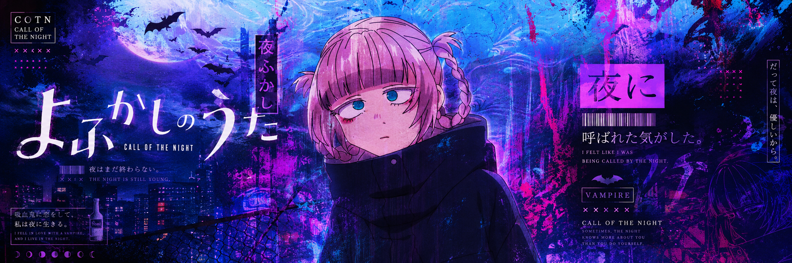

### 🌙 私のリポジトリへようこそ 🌙 ###
*Welcome to My Repository*

 

 

---

## 🌙 Tech Stack

| Category     | Tech Stack                                                                                                                                         | Description                   |
|:------------:|:---------------------------------------------------------------------------------------------------------------------------------------------------:|:-----------------------------:|
| **Language**     |      | Backend & frontend            |
| **Framework**    |     | Web development               |
| **Database**     |    | Relational & NoSQL databases  |
| **OS**           |   | Local development             |
| **IoT**          |    | Embedded systems & prototyping |

---

## 📜 Certifications

<table>
  <thead>
    <tr>
      <th>Year</th>
      <th>Certification</th>
      <th>Institution</th>
      <th>Details</th>
    </tr>
  </thead>
  <tbody>
    <tr>
      <td align="center"><b>2024</b></td>
      <td align="center">💻 Computer Software Programming</td>
      <td align="center"></td>
      <td align="center"><a href="certificates/Pemrograman%20Software%20Komputer.pdf">📄 View Certificate</a></td>
    </tr>
    <tr>
      <td align="center"><b>2024</b></td>
      <td align="center">🌐 Internet of Things Device Engineering</td>
      <td align="center"></td>
      <td align="center"><a href="certificates/Perekayasaan%20Perangkat%20IoT.pdf">📄 View Certificate</a></td>
    </tr>
  </tbody>
</table>

---

## 🦇 Featured Projects

### 🌙 SIPM — Machine Scheduling Information System

  
  

> A platform built for **scheduling and reporting** machine operations.  
> Manage machines, schedule operations, handle spare parts inventory, monitor stock levels, and generate efficient reports — all in one place.

---

### 🌙 Teman Kantor — Scheduling & Administration System

  
  

> A web-based system for **scheduling, borrowing, and data management**.  
> Designed to record employee information and monitor office administration agendas — efficiently and in an organized manner.

---

### 🌙 Poltekgradrepro — Final Project Repository System

  
  

> A **digital repository** giving students easy access to published final projects.  
> Supports research with relevant references, helping improve the quality of student work through structured examples.

---

### 🌙 Air Quality Monitoring (Prototype)

  

> An IoT-based system that monitors air quality in **real time** and detects harmful pollutants (smoke, CO₂, O₃, NO₂).  
> Sensor data is streamed to a server for analysis, with **automatic WhatsApp alerts** when dangerous levels are detected.  
> Built to raise awareness of air pollution and ensure safety, especially in laboratory environments.

---

### 🌙 IoT-Based Self-Service Payment System

  
  

> A self-service **cash payment kiosk** designed to help elderly patients unfamiliar with e-wallets.  
> Integrates a bill acceptor with the Xpdisi system, enabling cash transactions in hospitals with real-time monitoring — improving service efficiency in healthcare.

---

## 🌌 Let's Connect

 

&nbsp;

&nbsp;

